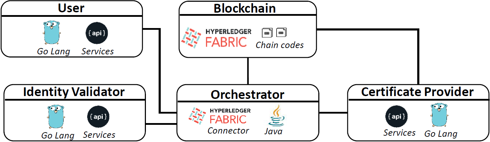
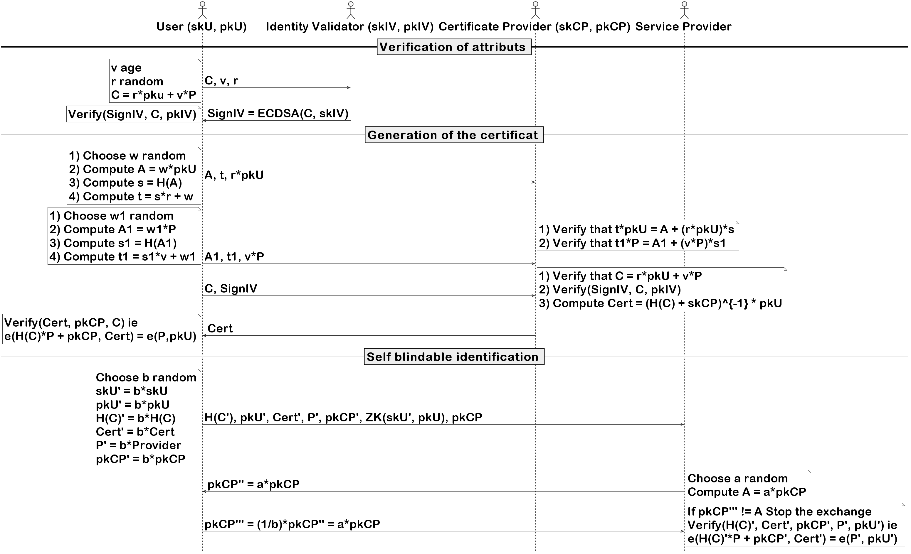

# Efficient, Self-Blindable and Privacy-Preserving Credential Scheme over Blockchain

This repository is a demonstrator for the protocol described in REF_TO_PAPER.

## Organization

The code is structured in 3 folders:
- ```blockchain```: Contains the script to launch the Hyperledger Blockchain and the chaincode to instantiate
- ```crypto```: Contains the JAVA orchestrator which will run the demo
- ```goService```: Contains the service which will manage and execute the cryptographic functions presented in the paper.

The architecture of the different services is organized as followed:




## Launch

In order to run the demo, the blockchain and the goService must be launch first. Once those services are up, the orchestrator can be launched.
Description on how to launch each service is described in the subdirectory associated to the service.

## The protocol



More details about the protocol are provided in the paper.
